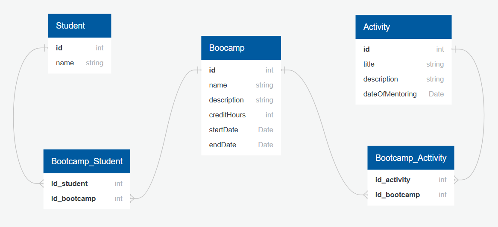

<h1 align="center">
  Boocamp
</h1>

Para dar início ao proojeto em sua máquina, você deve criar o banco de dados Postgres com o nome "bootcamp".

## Estrutura do Banco de dados

A estrutura foi feita utilizando o JPA, onde toda a estrutura das entidades é refletida automaticamente no banco de dados por meios de DDL.

A estrutura está ilustrada abaixo:

Feito em: https://app.quickdatabasediagrams.com/